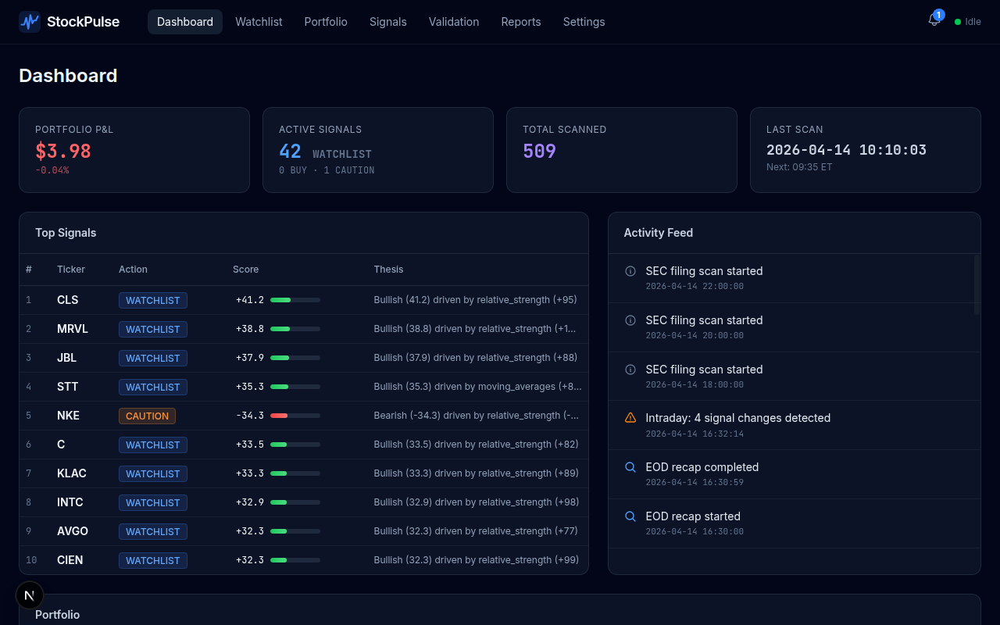
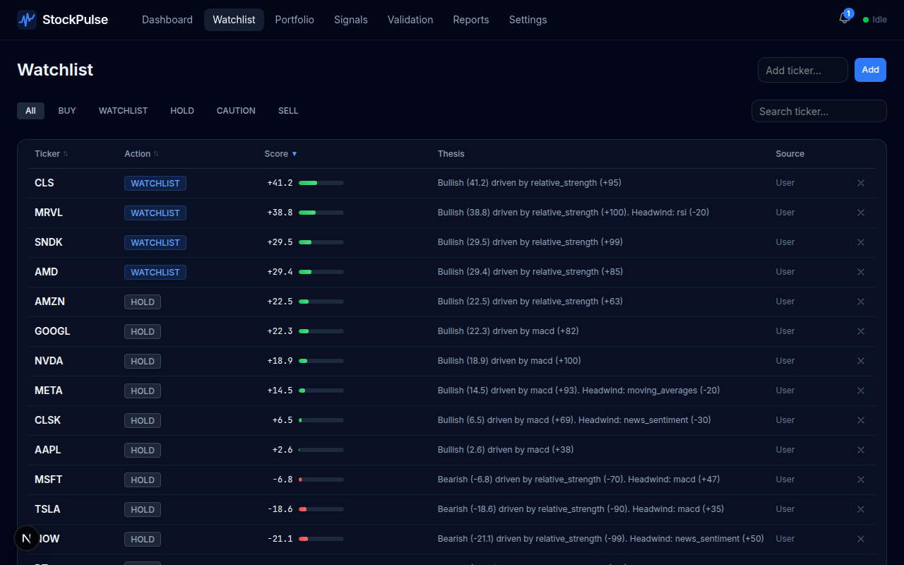
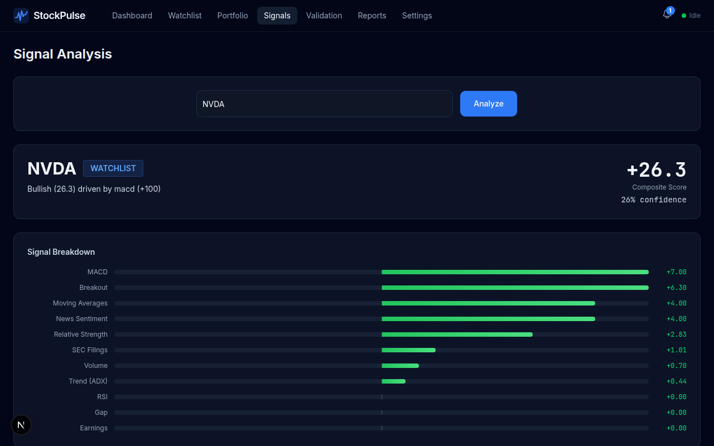

<div align="center">
  
  <h1>StockPulse</h1>
  <p><strong>Self-hosted stock trading research and alert system</strong></p>
  <p>
    
    
    
    
  </p>
  <p>Scans the S&P 500, generates buy/sell/hold recommendations with composite confidence scores, runs an always-on portfolio advisor, sends Telegram and Discord alerts, and includes a Dark Glass web dashboard.</p>
  <p><strong>Zero subscriptions. Free data only. Self-hosted. Never auto-trades.</strong></p>
</div>

---

## Dashboard

<p align="center">
  
</p>

## Watchlist

<p align="center">
  
</p>

## Signal Analysis

<p align="center">
  
</p>

---

## Table of Contents

- [Features](#features)
- [Architecture](#architecture)
- [Quick Start](#quick-start)
- [Web Dashboard](#web-dashboard)
- [Signal Engine](#signal-engine)
- [Portfolio Advisor](#portfolio-advisor)
- [Shariah Compliance Filter](#shariah-compliance-filter)
- [Market Regime Detection](#market-regime-detection)
- [Alerts](#alerts)
- [Scheduling](#scheduling)
- [API Endpoints](#api-endpoints)
- [Configuration](#configuration)
- [Data Sources](#data-sources)
- [Commands](#commands)
- [Testing](#testing)
- [License](#license)

---

## Features

### Scanning and Signals
- Daily S&P 500 scanning with 11 calibrated signals and a composite scoring engine
- 5-tier classification: **BUY** / **WATCHLIST** / **HOLD** / **CAUTION** / **SELL**
- 3-bucket confirmation system: signals must agree across Trend, Participation, and Catalyst
- Score acceleration bonus for improving tickers (capped at +5 points)
- Sector rotation overlay (+/- 4 points based on sector momentum)
- Post-earnings drift (PEAD) overlay with 5% weight on confirmed surprise + tape follow-through
- Relaxed WATCHLIST upgrade when trend + relative strength >= 60
- Auto-discovery of new opportunities; stale tickers removed after 5 days

### Portfolio Advisor (Always-On, Never Auto-Trades)
- Event-driven suggestions with 3 severity levels: Urgent, Actionable, Informational
- Priority ordering: risk actions -> new BUYs -> scale up existing -> new starters -> near-misses
- Progressive position sizing ladder (starter 3% -> add1 5% -> add2 7% -> full 12% on BUY)
- Market regime-aware cash reserves and threshold adjustments
- Entry timing assessment (RSI overbought, extended, gap chase prevention)
- Historical pattern matching via cosine similarity on signal profiles
- Tax lot tracking with FIFO sell selection, short/long-term classification, wash sale detection
- Swap suggestions with strict guardrails (min score gap, persistence, cluster separation)
- Cash chaining: freed cash from trims flows into deployment suggestions
- Weekly trend filter for position size adjustment
- EOD consolidated plan with narrative summary and net cash impact

### Risk Management
- Sector caps (25%), position limits (8%), correlation clustering
- Drawdown breakers: -8% half size, -12% pause new buys
- Earnings blackout (3-day no-entry window)
- ATR-based position sizing and stop levels
- Portfolio size tiers with dynamic limits (under $15k / $15-50k / over $50k)
- Concentration breach detection with automatic trim suggestions

### Shariah Compliance
- Industry exclusion based on AAOIFI standards
- Financial ratio screens (debt, cash, receivables vs market cap < 33%)
- User watchlist tickers bypass the filter
- Configurable toggle (on/off via settings)

### Web Dashboard
- Dark Glass themed UI with 9 pages
- Wealthsimple portfolio import (paste account text)
- Manual position add/edit/delete with "I Did This" execution feedback
- TradingView chart integration with signal overlay
- Markdown report viewer, sortable tables, collapsible sections
- Responsive layout

### Alerts and Validation
- Telegram alerts with severity formatting
- Discord webhook alerts
- Log file alerts
- Statistical validation: paired t-test, Wilcoxon, bootstrap CI, BUY vs WATCHLIST separation
- Signal performance tracking: 5/10/20-day returns vs SPY benchmark
- Validation milestone alerts at 30, 50, 75, 100, 150, 250 tracked signals

### LLM Integration
- Claude Sonnet for scanning (news sentiment analysis, SEC filing classification, thesis generation)
- Claude Opus for allocation advice
- Rules-based keyword fallback when LLM is unavailable

---

## Architecture

```
stockpulse (systemd)         stockpulse-api (port 18000)     stockpulse-ui (port 3003)
    |                              |                              |
    |-- 09:35 Morning scan    <-- REST API (FastAPI) -->     Dark Glass UI
    |-- 30min Intraday check       |                         9 pages
    |-- 16:30 EOD recap            |-- /api/dashboard        TradingView charts
    |-- 2h SEC filing scan         |-- /api/watchlist        Signal breakdown
    |-- 30min Portfolio check      |-- /api/portfolio        Report viewer
    |-- Signal tracking            |-- /api/signals          Advisor panel
    |-- Sun Weekly digest          |-- /api/advisor          Allocation advisor
    |                              |-- /api/allocate         Settings editor
    v                              |-- /api/validation       Portfolio import
  Telegram / Discord               |-- /api/reports
  alerts.log                       |-- /api/config
                                   v
                              outputs/reports/
                              outputs/json/
```

### Module Layout

```
stockpulse/
  signals/       # 11 signal calculators + composite engine + market regime
  portfolio/     # Advisor, allocation, entry timing, lots, risk, tracker
  scanners/      # Market scanner, catalyst scanner
  research/      # Recommendation engine, scoring, patterns, tracker, backfill
  data/          # Provider (yfinance, Finnhub), universe (S&P 500), cache
  sec/           # SEC EDGAR filings + insider transactions
  filters/       # Shariah compliance filter
  llm/           # Claude integration (news, filings, summarizer, fallback)
  alerts/        # Telegram, Discord, log dispatcher
  scheduler/     # APScheduler job definitions
  reports/       # Morning, intraday, EOD, weekly report generators
  config/        # Settings, strategies.yaml, portfolio.yaml, watchlists.yaml
  api/           # FastAPI server
  backtests/     # Backtest runner
  utils/         # Setup validator
```

---

## Quick Start

```bash
git clone https://github.com/NightBaRron1412/stockpulse.git
cd stockpulse

make setup                    # Create venv, install deps, copy config
# Edit .env — set FINNHUB_API_KEY (free at https://finnhub.io)
make check                    # Validate setup (API keys, connections)
make run                      # Run a one-shot S&P 500 scan
```

### Prerequisites

- Python 3.12+ (3.13 recommended)
- Node.js 18+ (for the web dashboard)
- A free [Finnhub](https://finnhub.io) API key
- Optional: Anthropic API key (for LLM-powered news sentiment and thesis generation)
- Optional: Telegram bot token + chat ID (for alerts)
- Optional: Discord webhook URL (for alerts)

---

## Web Dashboard

```bash
make api                      # Start FastAPI backend on port 18000
cd stockpulse-ui && npm i && npm run dev -- -H 0.0.0.0 -p 3003
```

Or start both together:

```bash
make ui                       # Starts API on :18000 + Next.js on :3000
```

Or install as systemd services for auto-start:

```bash
make install-service          # Install scanner as systemd service
systemctl --user start stockpulse-api stockpulse-ui
```

### Pages

| Page | Description |
|------|-------------|
| **Dashboard** | Portfolio summary, top signals, scan status, activity feed |
| **Watchlist** | User and auto-discovered tickers with live scores |
| **Portfolio** | Positions, P&L, drawdown status, tax lots, Wealthsimple import |
| **Signals** | On-demand ticker analysis with full signal breakdown |
| **Advisor** | Portfolio suggestions with severity levels, entry timing, pattern matches |
| **Allocate** | Investment allocation advisor with LLM-generated rationale |
| **Reports** | Morning, intraday, EOD, and weekly reports (Markdown viewer) |
| **Settings** | Signal weights, thresholds, risk params, scheduling, filters |
| **Validation** | Signal performance tracking and statistical validation results |

---

## Signal Engine

StockPulse computes 11 signals for each ticker, combines them into a weighted composite score, and classifies the result into one of five action tiers.

### Signals

| Signal | Weight | Description |
|--------|--------|-------------|
| **SEC Filing** | 18% | 8-K, 10-K/10-Q filings + Form 4 insider purchases. Half-life decay, diminishing returns via log1p. Raw cap of 25 without directional confirmation. |
| **Breakout** | 15% | Multi-period breakout (20/55/252 day) requiring volume confirmation (RVOL >= 1.5) |
| **Volume** | 14% | Relative volume (RVOL) with soft positive band (0.8-1.0). Participation confirm at RVOL 1.2. |
| **Relative Strength** | 11% | Multi-period (20/60 day) excess return vs SPY benchmark + sector ETF comparison |
| **Moving Averages** | 10% | 20 EMA / 50 SMA / 200 SMA stack with price-vs-MA (60%) and stack-slope (40%) blend |
| **News Sentiment** | 8% | LLM-analyzed news sentiment (Claude Sonnet) with keyword fallback |
| **RSI** | 7% | 14-period RSI with separate uptrend/downtrend zone scoring |
| **MACD** | 7% | 12/26/9 MACD crossover and histogram momentum |
| **ADX** | 6% | 14-period ADX trend strength indicator (threshold: 20) |
| **PEAD** | 5% | Post-earnings drift: EPS/revenue surprise + day-1 tape confirmation + gap hold. Only active 1-20 trading days after earnings. |
| **Gap** | 4% | Gap detection (>0.5%) normalized by ATR, excess vs sector |

### Composite Scoring

1. **Weighted average**: Each signal score is multiplied by its weight and divided by total weight to produce a composite score in [-100, +100].
2. **Sector rotation overlay**: +/- 4 points based on sector momentum ranking.
3. **Score acceleration bonus**: Up to +5 points when a ticker shows improving scores across multiple scans (requires score >= 25, breadth >= 2 buckets, persistence >= 2 scans).
4. **PEAD overlay**: Up to 5% weight for confirmed post-earnings drift signals.

### Confirmation Buckets

Signals are grouped into three buckets. A BUY requires the Trend bucket plus at least one of Participation or Catalyst:

| Bucket | Weight | Signals |
|--------|--------|---------|
| **Trend** | 45% | Moving Averages, MACD, ADX, Relative Strength |
| **Participation** | 35% | Volume, Breakout |
| **Catalyst** | 20% | SEC Filing |

A bucket confirms when its average signal score exceeds 15.

### Classification Thresholds

| Tier | Threshold |
|------|-----------|
| BUY | >= 55 (with bucket confirmation) |
| WATCHLIST | >= 32 (relaxed at 25 with trend + RS >= 60) |
| HOLD | Between WATCHLIST and CAUTION |
| CAUTION | <= -30 |
| SELL | <= -65 |

---

## Portfolio Advisor

The advisor runs after every scan and generates structured suggestions. It never executes trades automatically -- all actions require manual confirmation via the "I Did This" button in the UI.

### Suggestion Types (Priority Order)

1. **EXIT** (Urgent) -- Position hit SELL signal. Full exit recommended.
2. **TRIM_CAUTION** (Actionable) -- CAUTION persisted across multiple scans. Trim 25% (50% if score < -50).
3. **TRIM_CONCENTRATION** (Actionable) -- Position exceeds max position cap (8% default, with 10% buffer).
4. **RISK_ALERT** (Urgent/Actionable) -- Drawdown breaker triggered or half-size mode active.
5. **BUY_FROM_CASH** (Actionable) -- Deploy cash into BUY candidates with full position sizing.
6. **ADD_TO_POSITION** (Actionable) -- Scale up existing WATCHLIST position on the progressive ladder.
7. **SWAP** (Actionable) -- Sell weakest HOLD/CAUTION to fund a strong BUY. Requires: min score gap 20, persistence >= 2 scans, different cluster, max 1 swap/day.
8. **WATCHLIST_STARTER** (Actionable) -- Deploy excess cash into new WATCHLIST starter (33% of full position, max 3 names, 25% sleeve cap).
9. **NEAR_MISS** (Informational) -- Ticker improving but not yet starter-eligible. No dollar amounts.

### Progressive Position Sizing Ladder

| Stage | Target Weight | Trigger |
|-------|---------------|---------|
| Starter | 3% | WATCHLIST + 7 qualifiers pass |
| Add #1 | 5% | Score improvement >= 4, held >= 5 scans, trend confirms, RS >= 60, price above entry |
| Add #2 | 7% | Same qualifiers, already at Add #1 level |
| Full Position | 12% cap | BUY upgrade only |

### Guardrails

- Turnover limits: max 2 trims/week per position, min 3 trading day hold before trim
- Tax annotations: short/long-term gain/loss display, FIFO lot detail, wash sale warnings
- Cash chaining: freed cash from trims and exits flows into BUY and starter suggestions
- Weekly trend filter adjusts position sizes when weekly trend is down
- ETFs are excluded from single-position concentration checks

---

## Shariah Compliance Filter

Two-layer screen based on AAOIFI standards:

1. **Industry exclusion** -- Removes companies in conventional finance, alcohol, tobacco, gambling, and weapons industries. Uses GICS sector classification plus keyword matching.
2. **Financial ratio screen** -- Debt, cash, and receivables each must be < 33% of market cap.

User watchlist tickers bypass the filter. The filter can be toggled on/off from the Settings page or in `strategies.yaml` (`filters.shariah_only`).

---

## Market Regime Detection

Uses SPY price action, VIX levels, and market breadth to classify the current environment:

| Regime | Condition | Effect |
|--------|-----------|--------|
| **Trending** | SPY > 20 EMA > 50 SMA, ADX > 25 | Full deployment, normal thresholds |
| **Ranging** | SPY between 20 EMA and 50 SMA, ADX < 20 | 1.2x cash reserve, BUY threshold +5 |
| **Correcting** | SPY < 50 SMA or drawdown > 5% | 1.5x cash reserve, BUY threshold +10, starters disabled |
| **Selling Off** | SPY < 200 SMA or VIX > 25 | 2.0x cash reserve, BUY threshold +20, starters disabled |

---

## Alerts

### Channels

| Channel | Config Key | Description |
|---------|------------|-------------|
| **Telegram** | `TELEGRAM_BOT_TOKEN` + `TELEGRAM_CHAT_ID` | Formatted alerts with severity indicators |
| **Discord** | `DISCORD_WEBHOOK_URL` | Webhook-based alerts |
| **Log File** | Always on | JSON-line log at `outputs/logs/alerts.log` |

### What Gets Alerted

- BUY signals (with HIGH CONVICTION flag when applicable)
- SELL signals
- WATCHLIST signals (confidence >= 45)
- Position CAUTION (held position drops below +10 composite)
- Advisor suggestions (Urgent and Actionable only, state-change gated)
- EOD consolidated plan summary
- Portfolio P&L milestones
- SEC filing discoveries
- Validation milestones (at 30, 50, 75, 100, 150, 250 tracked signals)

---

## Scheduling

All times in US/Eastern. Managed by APScheduler, runs as a systemd user service.

| Job | Schedule | Description |
|-----|----------|-------------|
| Morning Scan | 09:35 | Full S&P 500 scan + report + advisor evaluation |
| Intraday Check | Every 30 min | Watchlist re-scan, detect tier changes and score movements |
| EOD Recap | 16:30 | End-of-day report + consolidated advisor plan |
| SEC Filing Scan | Every 2 hours | Check 8-K, 10-K, Form 4 filings for watchlist tickers |
| Portfolio Check | Every 30 min | P&L milestones and invalidation alerts |
| Signal Tracking | After scans | Track BUY/WATCHLIST outcomes for validation |
| Weekly Digest | Sunday | Weekly performance summary |

---

## API Endpoints

Base URL: `http://localhost:18000`

### Dashboard and Activity
| Method | Endpoint | Description |
|--------|----------|-------------|
| `GET` | `/api/dashboard` | Portfolio summary, top signals, activity, scan status |
| `GET` | `/api/activity` | Parsed activity log (last 30 events) |
| `GET` | `/api/scan/status` | Current scan status (running, progress, last completed) |
| `POST` | `/api/scan` | Trigger a manual morning scan |

### Watchlist
| Method | Endpoint | Description |
|--------|----------|-------------|
| `GET` | `/api/watchlist` | All watchlist tickers with latest scores |
| `GET` | `/api/watchlist/{ticker}` | Detailed analysis for a single ticker |
| `POST` | `/api/watchlist/add` | Add ticker to user watchlist |
| `POST` | `/api/watchlist/remove` | Remove ticker from watchlist |

### Portfolio
| Method | Endpoint | Description |
|--------|----------|-------------|
| `GET` | `/api/portfolio` | Positions, P&L, drawdown, cash |
| `GET` | `/api/portfolio/lots/{ticker}` | Tax lot detail for a position |
| `POST` | `/api/portfolio/cash` | Update cash balance |
| `POST` | `/api/portfolio/import` | Import from Wealthsimple (paste text) |
| `POST` | `/api/portfolio/position` | Add or update a position |
| `DELETE` | `/api/portfolio/position/{ticker}` | Remove a position |

### Signals and Analysis
| Method | Endpoint | Description |
|--------|----------|-------------|
| `POST` | `/api/analyze/{ticker}` | On-demand full signal analysis |
| `GET` | `/api/quote/{ticker}` | Current quote |
| `GET` | `/api/history/{ticker}` | OHLCV price history |

### Portfolio Advisor
| Method | Endpoint | Description |
|--------|----------|-------------|
| `GET` | `/api/advisor/suggestions` | Current suggestions with regime info |
| `GET` | `/api/advisor/plan` | Latest EOD consolidated plan |
| `GET` | `/api/advisor/config` | Advisor configuration |
| `POST` | `/api/advisor/evaluate` | Trigger manual advisor evaluation |
| `POST` | `/api/advisor/acknowledge` | Dismiss a suggestion |
| `POST` | `/api/advisor/execute` | Execute a suggestion ("I Did This") |

### Allocation
| Method | Endpoint | Description |
|--------|----------|-------------|
| `POST` | `/api/allocate` | Suggest allocation for a dollar amount |

### Reports and Validation
| Method | Endpoint | Description |
|--------|----------|-------------|
| `GET` | `/api/reports` | List all reports (morning, intraday, EOD, weekly) |
| `GET` | `/api/reports/{filename}` | Read a specific report (Markdown) |
| `GET` | `/api/validation` | Signal tracking and statistical validation data |
| `GET` | `/api/alerts/recent` | Last 50 alerts from the log |

### Backtesting
| Method | Endpoint | Description |
|--------|----------|-------------|
| `POST` | `/api/backtest` | Start a backtest run |
| `GET` | `/api/backtest/status` | Check backtest progress |
| `GET` | `/api/backtest/tearsheet` | Serve latest backtest tearsheet (HTML) |

### Configuration
| Method | Endpoint | Description |
|--------|----------|-------------|
| `GET` | `/api/config` | Read all configuration (signals, thresholds, risk, scheduling) |
| `POST` | `/api/config/update` | Update thresholds, risk, scheduling, filters, allocation, advisor settings |

---

## Configuration

All configurable from the web UI Settings page or via YAML files:

| File | Contents |
|------|----------|
| `stockpulse/config/strategies.yaml` | Signal weights, thresholds, risk limits, allocation rules, advisor config, market regime settings, scheduling |
| `stockpulse/config/watchlists.yaml` | User watchlist, auto-discovered tickers, priority list |
| `stockpulse/config/portfolio.yaml` | Positions with lots, cash balance, peak equity (gitignored) |
| `.env` | API keys (Finnhub, Anthropic), Telegram bot token/chat ID, Discord webhook URL, LLM model selection |

### Key Configuration Sections

**Thresholds** -- BUY (55), WATCHLIST (32), relaxed WATCHLIST (25), CAUTION (-30), SELL (-65), exit (15), confidence minimum (55)

**Risk** -- Max position 8%, max sector 25%, risk per trade 0.75%, max 8 positions, drawdown half at -8%, drawdown pause at -12%, earnings blackout 3 days

**Allocation** -- Full position only on BUY, WATCHLIST starter at 33% of full with 7 qualifiers, max 3 watchlist names, 25% watchlist sleeve, 5-day timeout, progressive adds with min hold/improvement/trend/RS requirements

**Portfolio Advisor** -- Evaluate after every scan, push only on state change, manual execution, trim on persistent CAUTION (2 scans), swap guardrails (min score 60, gap 20, persistence 2, 1/day max), turnover limits (2 trims/week, 3 day min hold)

---

## Data Sources

| Source | Data | Cost |
|--------|------|------|
| [Finnhub](https://finnhub.io) | Quotes, news, earnings calendar | Free |
| [Yahoo Finance](https://finance.yahoo.com) (yfinance) | Historical OHLCV, bulk download | Free |
| [SEC EDGAR](https://www.sec.gov/edgar) | 8-K, 10-K/10-Q filings, Form 4 insider transactions | Free |
| [Wikipedia](https://en.wikipedia.org/wiki/List_of_S%26P_500_companies) | S&P 500 constituent list | Free |
| Claude API (Anthropic) | News sentiment, filing analysis, allocation rationale | Optional (paid) |

---

## Commands

| Command | Description |
|---------|-------------|
| `make setup` | Create venv, install deps, copy config |
| `make check` | Validate API keys and connections |
| `make run` | One-shot S&P 500 scan |
| `make start` | Start the scheduler (background scanning) |
| `make stop` | Stop the scheduler service |
| `make test` | Run the test suite |
| `make api` | Start FastAPI backend on port 18000 |
| `make ui` | Start both API and Next.js frontend |
| `make backtest` | Run a 6-month backtest |
| `make install-service` | Install as systemd user service (auto-start on boot) |
| `make enter TICKER=GOOGL` | Record a position entry with risk checks |
| `make clean` | Remove outputs, cache, and generated files |
| `make status` | Show scheduler and service status |

---

## Testing

The test suite covers all major modules with 335+ unit tests across 27 test files:

```bash
make test
```

Test coverage includes: signals (technical, fundamental, composite, engine), portfolio (allocation, advisor, lots, entry timing, risk, tracker), scanning, recommendations, market regime, Shariah filter, pattern matching, intraday detection, API endpoints, LLM integration, caching, configuration, and Telegram alerts.

---

## Safety

- Research tool only -- not financial advice
- Never auto-trades; all execution is manual
- Risk limits enforced at every level (position, sector, drawdown, turnover)
- Earnings blackout prevents entries near reporting dates
- Drawdown breakers halt new positions during steep declines
- Advisor suggestions include tax impact notes and wash sale warnings

---

## License

MIT License. See [LICENSE](LICENSE).
